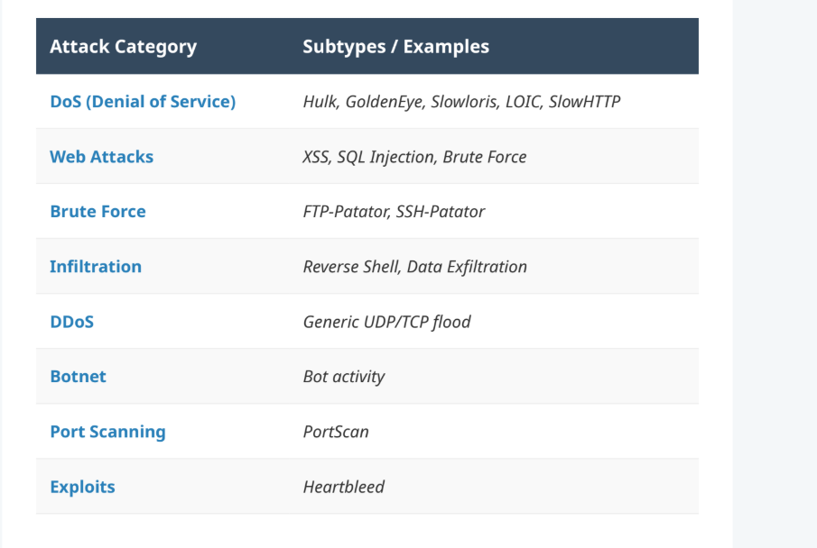
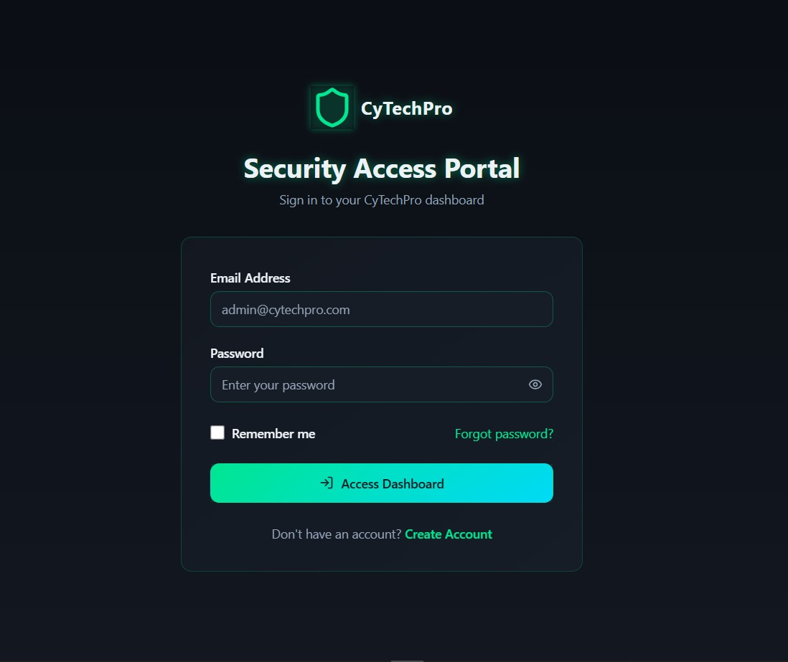
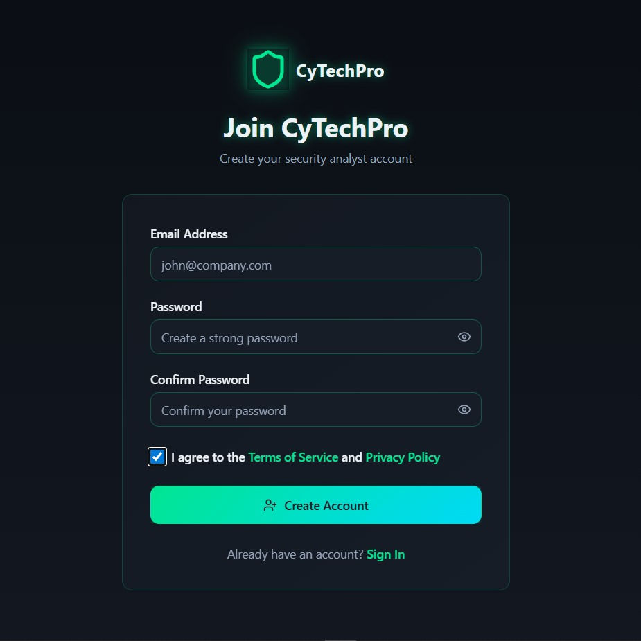
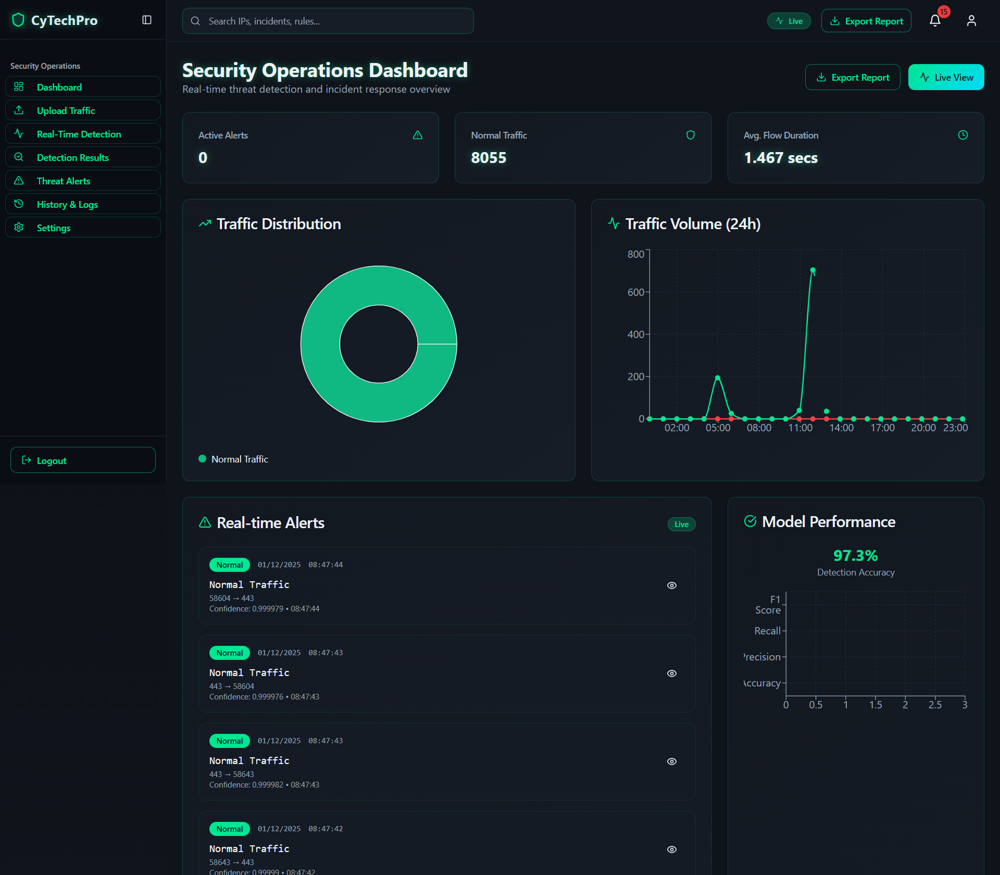
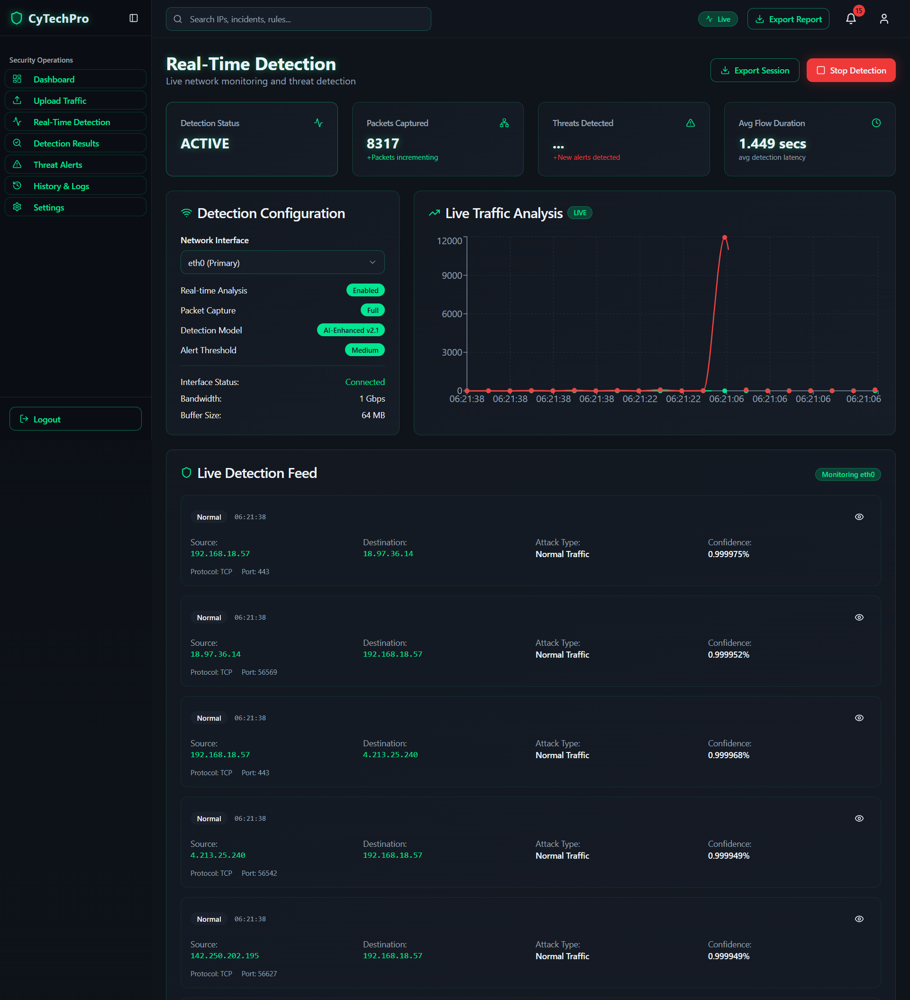
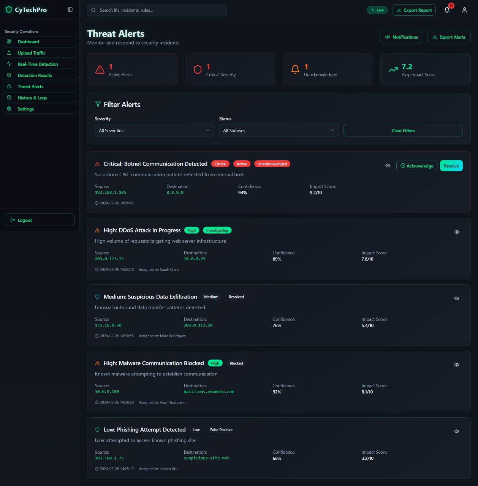
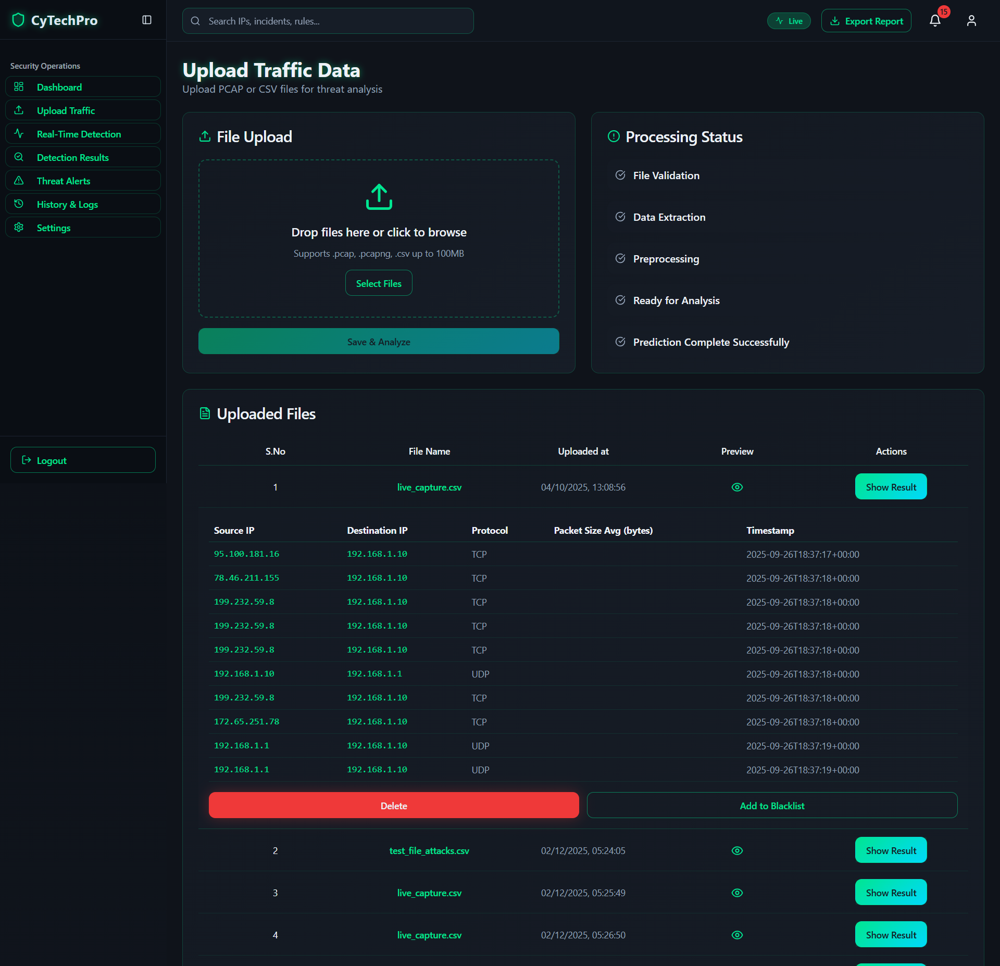
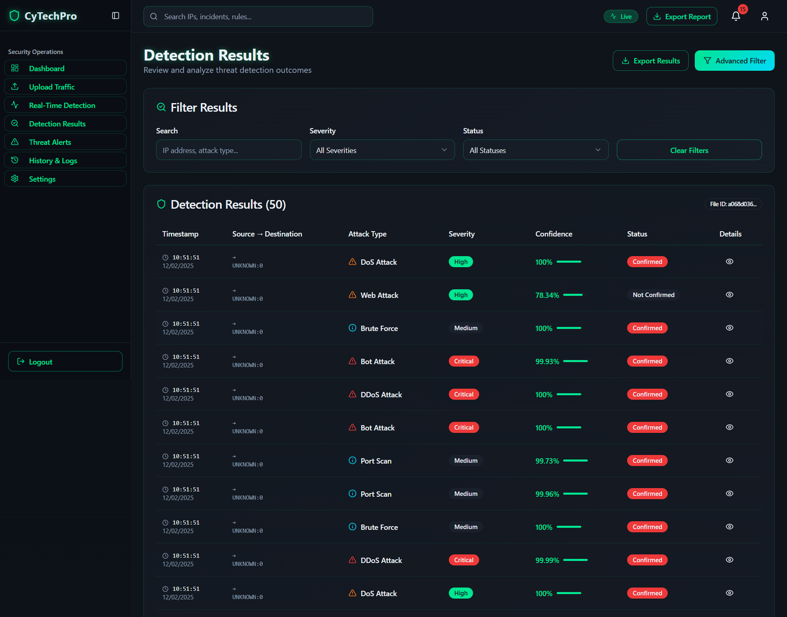
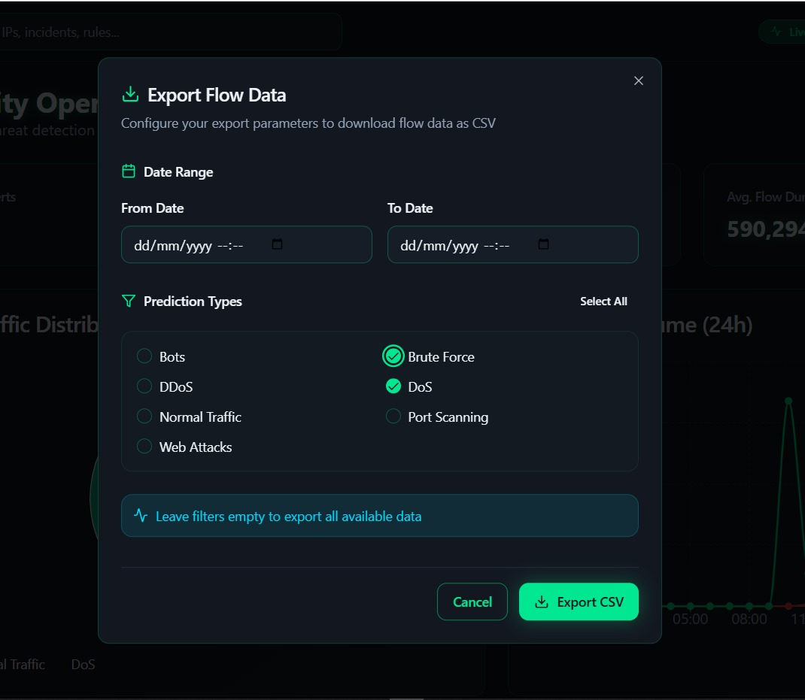

# 🚨 ML-Based Intrusion Detection System (IDS)

# CyTechPro-IDS

## 🔗 Live Demo

👉 https://cytechpro-ids-market-site.vercel.app/

## 🧠 Overview

This project is a hybrid Intrusion Detection System combining:

- Offline-trained ML models (Random Forest, XGBoost, CatBoost, LightGBM)
- Real-time traffic analysis
- Multi-class attack classification

## 📊 Dataset

- CICIDS2017

## ⚙️ Features

- Real-time packet monitoring
- Attack classification (DoS, DDoS, Brute Force, etc.)
- Scalable ML pipeline
- Admin dashboard (Vercel deployed)

## 🛡️ Attack Categories Covered

## 🏗️ Architecture

- Data preprocessing (SMOTE, cleaning)
- Model training (ensemble learning)
- Real-time detection module

## 🔒 Source Code

The full source code is private for security and intellectual property reasons.
However, the live demo and system behavior can be explored through the deployed application.

## 📸 Screenshots

# Login

# Sign Up

# Dashboard

# Realtime Detection

# Threat Alert Screen

# Upload Traffic

# Detection Result

# File Export

## 📬 Contact

If you're interested in collaboration or reviewing the code, feel free to reach out.
# 📧 sekamrankhan@gmail.com
